# Car-Rent-Practice-In-The-Third-Year-Of-College
It is my practical assignment, which I completed in my third year of college.

 

The main goal of creating a database is to automate the process of registering cars in a car rental company.
The database is designed to collect, update and record information about cars in the company.
There is a need to collect all the input data, which at the moment are transferred only to paper (car characteristics, customer data, data on contracts and company employees) and transfer them into electronic form.
Required documentation: transport documentation for each car, passport data of the client, passport data of the employee.
How the car rental process works: The client can contact the company directly or through the program and rent a car that suits him. All the necessary information about the client is known in advance. Then the client simply picks up the car from the company's parking lot and uses it all the time for which he paid. During this time, the car is considered rented, and no one can order it until the end of the rental period of the current client.

Output
The second step will be the automation of vehicle accounting processes by obtaining output data for the following purposes:
1. Data analysis
2. Knowledge of the exact values ​​(which cars are currently occupied, which customers are now actively using the services of the company, sums of money for the entire period, etc.)

Having the information in the tables, it is necessary to obtain the following information on car registration:
ALL FOLLOWING TASKS ARE FULFILLED THROUGH REQUESTS / REPORTS.

1. The total amount of money for each car for the entire period:
Received data: Information about the car, the total amount of money. According to the formula (amount (total amount), grouping by car code).
2. Customer data by different attributes:
Received data: Name, surname, passport code of the client, phone number, residential address, birthday of the client, photo. Search for each of the above attributes.
3. Data about employees by different attributes:
Received data: Name, surname, passport code of the employee, phone number, residential address, birthday of the employee, photo, login, email, position. Search for each of the above attributes.
4. Data about the car for different attributes:
Obtained data: brand, model, state. number, fuel type, body type, number of seats, cost, photo, additional functions, color, transmission type. Search for each of the above attributes.
5. Information about clients as well as their general contracts.
Received data: names, surnames, number of contracts. Formula (Counter (client code) in the contracts table).
6. The total amount of money earned on the rental of each car.
Received data: car name, total amount. Formula (
Sum (Total amount), grouping by car) + total sum of all cars.
7. Display free, busy and unavailable cars:
Findings: Make and model of all available vehicles
Findings: Make and model of all occupied vehicles
Findings: Make and model of all unavailable vehicles
Automation of more complex processes:
1. The total amount for car rental must be calculated and added to the table through the procedure
Required formulas: Price * Difference (Last day of car rental - First day of car rental)
2. Delete information about the contract that was canceled.
3. Delete customer information.
4. Delete information about the car.
5. Add a new client to the database
6. Add a new car to the database.
7. Add a new employee to the database.
Data security
1. Creating a full backup of the Database
The database should always be in multiple copies to avoid any problems. It should be possible to restore this data at any time.
2. Distribution of roles.
Guest, admin, employee, accountant, director.

  
(Click on image to watch the video) 

  

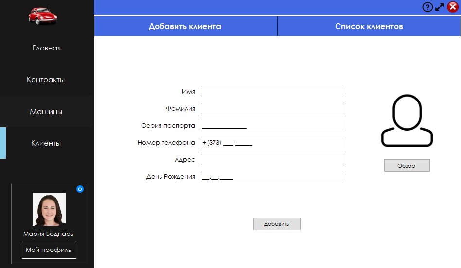

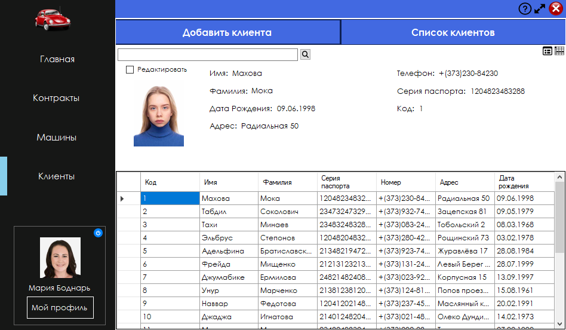
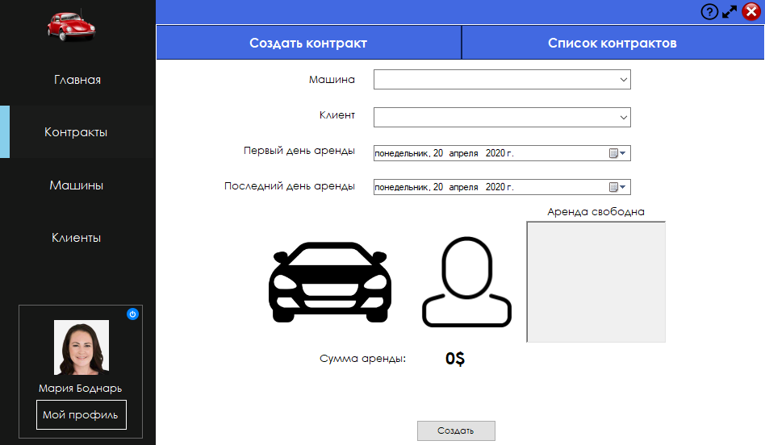
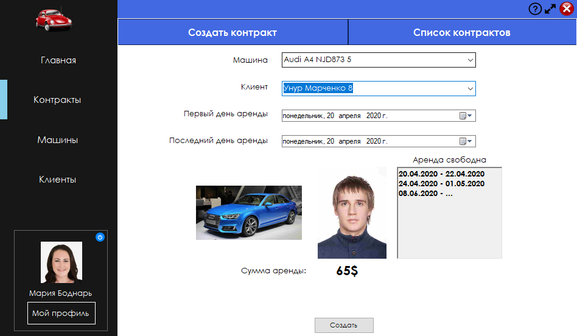
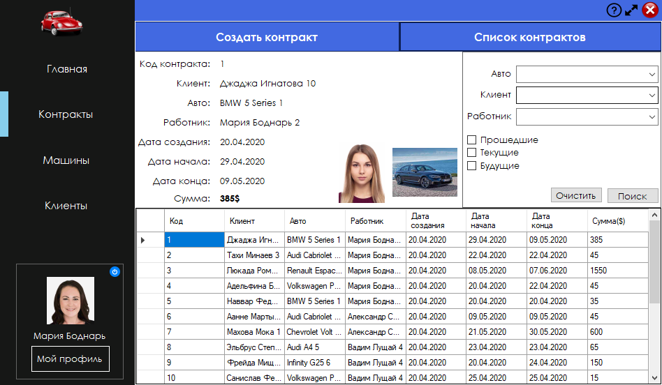
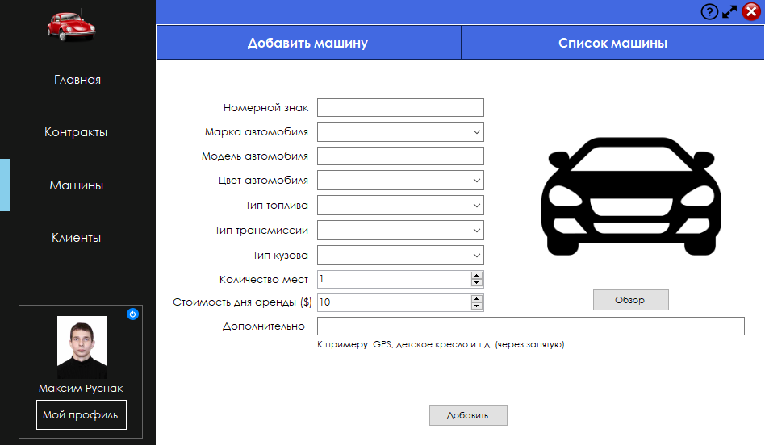
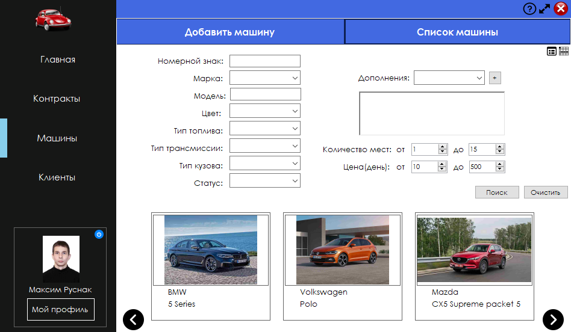
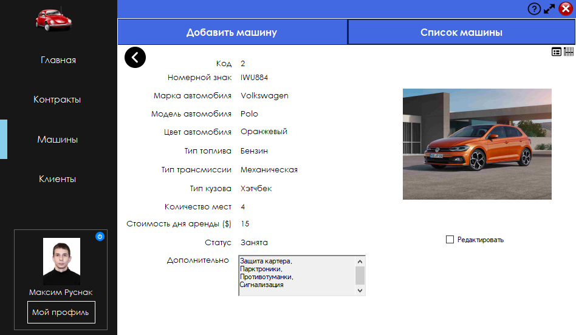
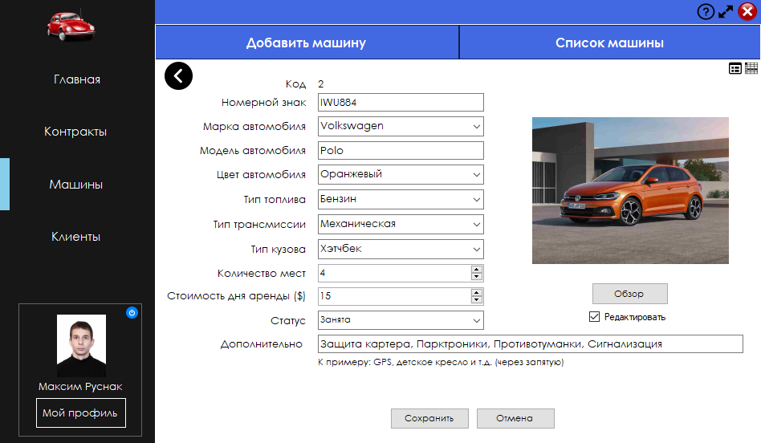
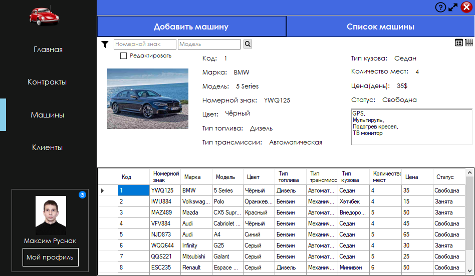
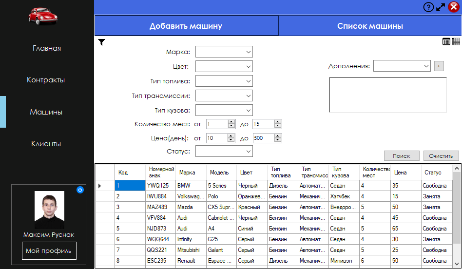
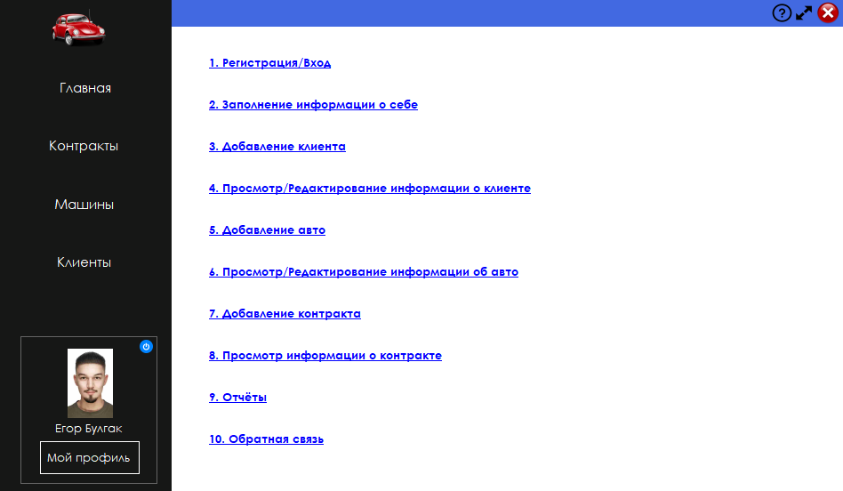
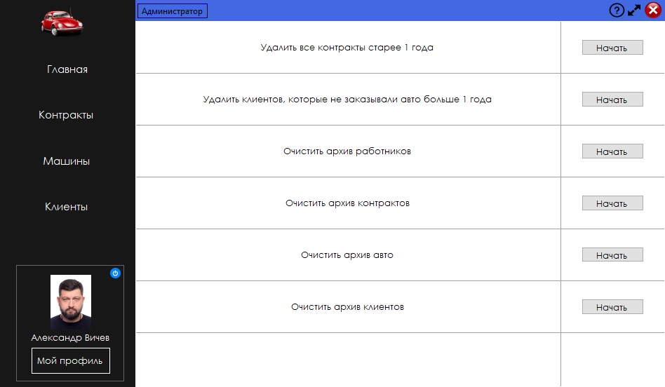
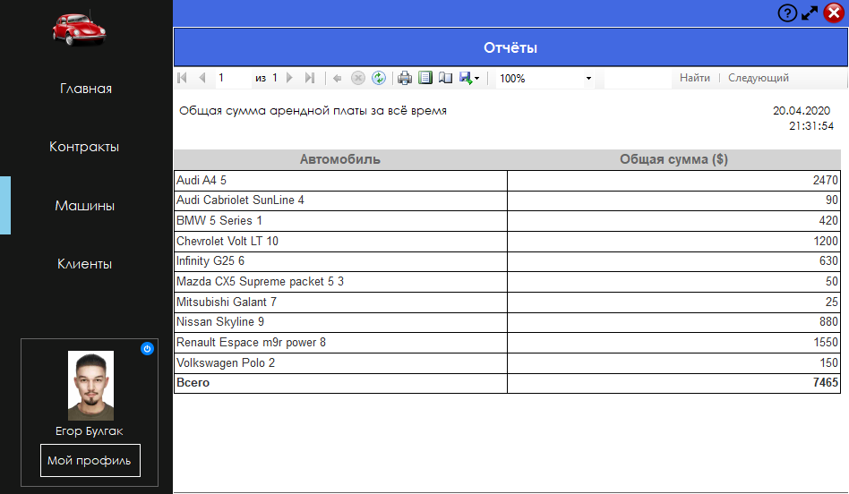
